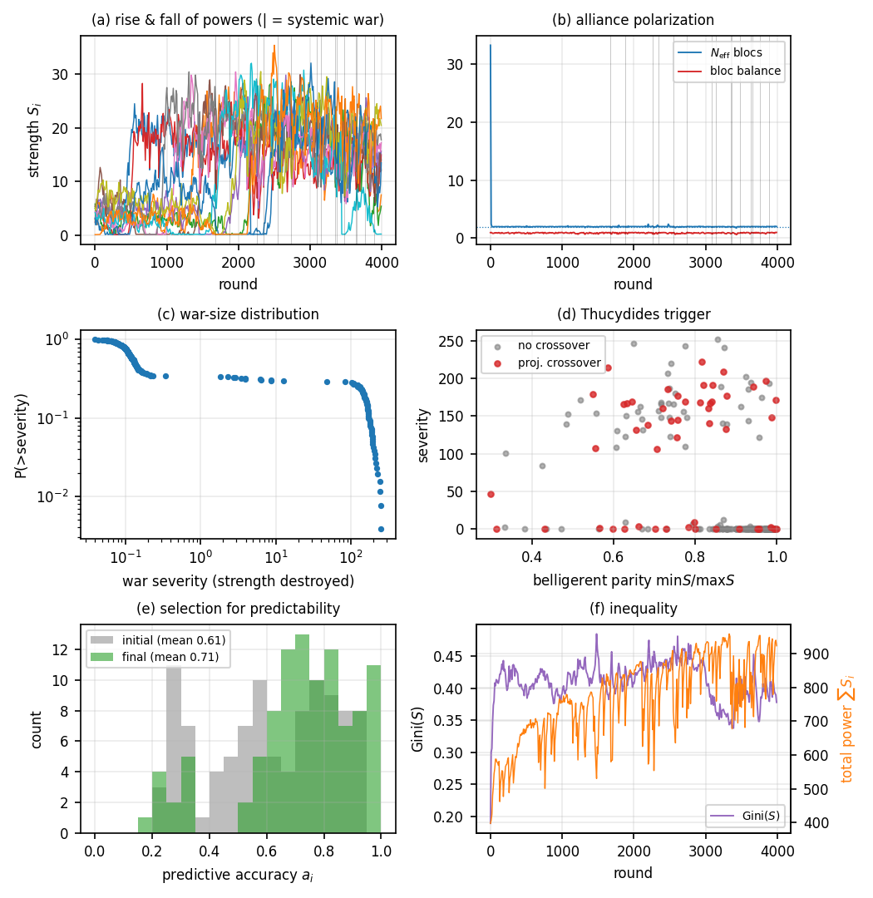

# A self-organising Thucydides trap: growth, predictability, alliances

**M. Heltberg — initial note, June 2026**
*Subproject `selforg_alliances/`. Independent of the lattice Gillespie model in
the parent repo; built from scratch on the brief's minimal principles. Code:
`thucydides_selforg.py`, figures `make_figures_selforg.py`, controls
`experiments_selforg.py`.*

---

## 1. Aim

Reproduce the Thucydides trap — a rising challenger and an established power
driven to systemic war — from **minimal, self-organising** principles, with two
ingredients in the lead role:

1. **Predictability.** Each state forecasts the *growth* of the others and acts
   (war / ally / wait) on the forecast. Predictability is **endogenous and under
   selection**: states that fail to anticipate are destroyed.
2. **Balancing alliances.** States ally to avoid being attacked by a much
   stronger power. The hoped-for outcome is a **bimodal (two-bloc) structure** as
   the configuration from which the big war breaks out.

## 2. Model

$N=100$ states, continuous strength $S_i(t)\ge 0$.

**(i) Resource-bounded stochastic growth.** Itô, Euler–Maruyama,
$$
dS_i=\Big[\gamma_i\,S_i\big(1-\tfrac{S_i}{c_i}\big)\,R(t)-\delta S_i\Big]dt
      +\sigma\sqrt{S_i}\,dW_i,\qquad R(t)=\max\!\big(0,\,1-\tfrac{\sum_j S_j}{K}\big).
$$
Heterogeneous intrinsic rate $\gamma_i$ and per-state capacity $c_i$ (log-normal
"territory" → a great-power/minor-power hierarchy). The global factor $R$ is the
shared-resource ceiling: no infinite growth. Demographic $\sqrt{S}$ noise (CIR
type) keeps $S\ge 0$.

**(ii) Predictability.** Each state keeps an EMA estimate of every state's slope
$\dot S_j$ and projects $\hat S_j(t{+}h)=S_j+h\,\dot S_j$. State $i$ perceives
others with accuracy-limited noise of scale $\propto(1-a_i)$, $a_i\in(0,1]$.
Accuracy is heritable + mutated; eliminated states respawn as offspring of
survivors → **selection on $a_i$**. Foresight is made protective (see iv).

**(iii) Balancing alliances.** Each round a fraction of states reconsider their
bloc. A state balances only against a *salient* threat (a rival bloc
$>\,$`threat_thresh`$\times$ its own strength), joining the largest non-threat
bloc that best matches the threat; if its own bloc already dwarfs the threat it
defects (coalitions dissolve once their rationale is gone). No geography/ideology
is imposed — bloc structure is fully emergent.

**(iv) War — the Thucydides trigger.** Any sufficiently balanced pair of blocs
($\min/\max$ strength $>0.25$) may fight, with hazard
$$
\lambda \;=\; w\cdot \underbrace{\tfrac{\min(S_A,S_B)}{\max(S_A,S_B)}}_{\text{parity}}
            \cdot \underbrace{\big[1+e^{-\kappa\,c}\big]^{-1}}_{\text{rising-challenger}},
\qquad c=\frac{h\,(\dot S_{\rm chall}-\dot S_{\rm rul})}{S_A+S_B},
$$
i.e. war fires preferentially at **parity *and* when the weaker side's projected
growth is closing the gap** (preventive war against a riser). Once initiated
between two lead states, each ally decides **independently**, from its own
accuracy-limited forecast, whether to join (logistic in projected win
probability and perceived threat). Outcome is Lanchester:
$P(A)=S_A^{q}/(S_A^{q}+S_B^{q})$. The losing side pays `loss_lose`, the winner
`loss_win`. **Predation:** a weak *unaligned* state next to a strong bloc is
conquered with hazard $\propto(1-0.85\,a_i)$ — the blind get eaten, the
foresighted ally in time and survive. Eliminated states respawn weak as
singletons → continual turnover.

Parameters (baseline): $K{=}1500,\ \delta{=}0.035,\ \gamma\in[0.06,0.16],\
\sigma{=}0.16,\ c_i\sim\text{LogN}(\bar c{=}12,0.6),\ h{=}25,\ w{=}0.05,\
\kappa{=}12,\ q{=}1.6$. 4000 rounds.

## 3. Results

*Figure.* (a) rise-and-fall of the strongest powers, systemic wars marked;
(b) alliance polarization $N_{\rm eff}$ and bloc balance; (c) war-size CCDF;
(d) Thucydides trigger — severity vs belligerent parity, red = projected
crossover; (e) selection on predictive accuracy (initial→final); (f) inequality
and total power (sawtooth = grow/war/regrow).

Aggregates over **8 seeds** (mean ± sd), with two mechanism controls:

| Quantity | Baseline | Reading |
|---|---|---|
| Effective # blocs $N_{\rm eff}$ | **1.99 ± 0.03** | system self-organises to **bipolarity** |
| Bloc balance $1-\lvert f_1-f_2\rvert/(f_1+f_2)$ | **0.92 ± 0.06** | the two camps are **strength-balanced** |
| Gini$(S)$ | 0.40 ± 0.08 | persistent great/minor-power hierarchy |
| Predictive accuracy $\bar a$ | **0.58 → 0.67** | **selected upward** (init sd only 0.03) |
| Crossover fraction, systemic wars | **0.44 ± 0.07** | systemic wars are rising-challenger wars |
| Crossover fraction, small wars | **0.11 ± 0.03** | — 4× enrichment |
| War-size distribution | heavy-tailed (≈4 decades, panel c) | small skirmishes → systemic wars |

**Main outcomes.**

1. **Bipolarity is the robust attractor.** Pure self-organised balancing drives
   $N_{\rm eff}\to 2$ with balanced camps, every seed. The bimodal alliance
   structure the brief hoped for *is* the generic state of the system — it is the
   standing backdrop, not a rare precursor.
2. **Systemic wars are Thucydidean.** Within the bipolar structure, the *big*
   wars are timed by a **projected power crossover** (rising challenger): 44% of
   systemic wars carry a crossover vs 11% of skirmishes, and systemic wars fire
   *below* full parity ($0.75$ vs $0.90$) — i.e. **preventively, before the
   challenger arrives**. Control $\kappa=0$ (trigger off) roughly halves the
   systemic-war crossover fraction ($0.44\to0.25$).
3. **Predictability self-organises.** Accuracy rises $0.58\to0.67$ under
   selection. Removing the explicit foresight→survival coupling
   (accuracy-neutral predation) cuts the gain ($\to0.64$) but does not erase it:
   foresight also pays through better war-join decisions. Predictability is thus
   selected through *several* channels, dominated by avoiding predation.
4. **Heavy-tailed war sizes + rise-and-fall cycles** emerge without tuning
   (panels a, c, f): total power runs as a sawtooth — grow under the ceiling,
   systemic war resets it, regrow.

## 4. Interpretation & novelty (literature flags)

The pieces map onto known results — important to be honest about what is *not*
new before claiming PRL novelty:

- **Bipolarity from balancing** is essentially Galam's spin-glass coalition
  result (Galam, *Physica A* 1998/2002; Axelrod–Bennett "landscape theory" 1993,
  which retrodicted the WWII line-up). That balancing → two blocs is *expected*.
- **Power-law war sizes from a self-organising geopolitical model** is Cederman,
  *APSR* 2003 ("Modeling the size of wars", SOC) — and is exactly the
  phenomenology of the parent repo's lattice model. Not new on its own.
- **Preventive war against a riser** is power-transition theory (Organski–Kugler
  1980; Lemke), popularised as the "Thucydides trap" (Allison 2017). Standard in
  IR, comparatively fresh as a *dynamical-systems trigger*.

**What looks genuinely new** is the *combination*: a continuous-time **Langevin**
geopolitics in which (a) **predictability is an endogenous trait under
selection**, not a fixed rationality assumption, and (b) systemic wars are timed
by a **projected-growth crossover** inside a self-organised bipolar structure.
The selection-for-foresight element — *states are pushed to become predictable
because the unpredictable are eaten* — is the part I have not seen in the
physics or IR-ABM literature.

## 5. Limitations of this v0

- Bipolarity is *too* robust ($N_{\rm eff}$ pinned at 2): with no latent
  geography/ideology, balancing trivially collapses to two blocs, so the
  multipolar↔bipolar *transition* (arguably the most interesting object) is
  absent. The model cannot currently show bipolarity *emerging* before a war
  because it is bipolar essentially always.
- The "big-war" cut (≥10% of world power destroyed) is a threshold, not an
  intrinsic scale; the heavy tail should be characterised as a distribution, not
  binarised.
- Selection on $a_i$ is real but shallow (Δ≈0.1); the fitness gradient is
  parity-limited and partly hand-installed via the predation coupling.
- Alliances are connected-component labels; no notion of a state in two
  alliances, of alliance *reliability*, or of reputation.

## 6. How to proceed (ranked)

**A. Make multipolar↔bipolar a real transition (highest value).**
Add a latent position $x_i$ (1-D ring or 2-D) — geography/ideology. Let balancing
prefer *near* partners and threat fall off with distance. Then regional
(multipolar) blocs are the low-tension phase, and a single rising hegemon
overrides locality to force **global bipolarisation**. The order parameter
$N_{\rm eff}$ then *moves*, and one can ask the sharp question: **does
$N_{\rm eff}\to 2$ predict the next systemic war?** This converts finding (1)
from "always bipolar" into a genuine precursor — the PRL hook.

**B. Find the sharp single claim + scaling law (PRL discipline).**
Two candidates:
  - *Predictability ↔ stability scaling.* Sweep the selection strength / mean
    accuracy $\bar a$ and measure systemic-war rate or mean inter-war time
    $\tau(\bar a)$. Hypothesis: better collective foresight **lengthens the long
    peace** but **enlarges** the eventual war (preventive wars launched earlier,
    at higher stakes) — a predictability–severity trade-off with a clean
    exponent. This is novel and PRL-shaped.
  - *Critical line in $(w,\kappa)$* separating a "frozen bipolar long peace" from
    a "churning" phase, with diverging fluctuations / power-law inter-war times
    at the boundary (SOC vs tuned criticality — test which).

**C. Analytics.** A 2-population mean-field (two blocs of strengths $S_A,S_B$
under the growth SDE + crossover-triggered reset) is low-dimensional and likely
tractable: a Langevin/Fokker–Planck for the gap $g=S_A-S_B$ with an absorbing
"war" boundary at projected crossover gives a **first-passage** prediction for
the inter-war time distribution — the analytic backbone a PRL wants. Small-$N$
and weak-noise limits check the simulation.

**D. Confront data (reuse, don't rebuild).** The parent repo already loads COW /
NMC / MID. Two cheap tests: (i) does the empirical major-power system sit near
$N_{\rm eff}\approx2$ before systemic wars (1914, 1939, Cold War)? (ii) is
relative-CINC *slope* (rising challenger), not level, the better war predictor —
the projected-crossover claim, directly testable on NMC time series.

**E. Cleanups.** Characterise the war-size tail (MLE power-law exponent + $x_{\min}$,
Clauset–Shalizi–Newman) instead of the 10% cut; add a reliability/defection
parameter to alliances; check robustness of selection to mutation rate.

**Recommended first move:** **A + the $\tau(\bar a)$ scaling in B** — together
they turn the two lead ingredients (alliances, predictability) into one
measurable precursor and one scaling law, which is enough spine for a PRL.
